# MALLTODO电商联盟系统 V2.0（可免费商用）
版权所有 (R) MALLTODO 保留所有权利。

感谢您选择MALLTODO电商联盟系统（以下简称MALLTODO），MALLTODO由郑州掌勺信息技术有限公司开发，是目前国内强大、稳定的导购返利类网站建设解决方案之一，基于 JAVA + MySQL 的技术开发，全部源码开放。

**2.0版本集成了MALLTODO零代码企业建站系统。**

MALLTODO的官方网址是： www.malltodo.com 
MALLTODO电商联盟系统网址：union.malltodo.com

# MALLTODO软件截图

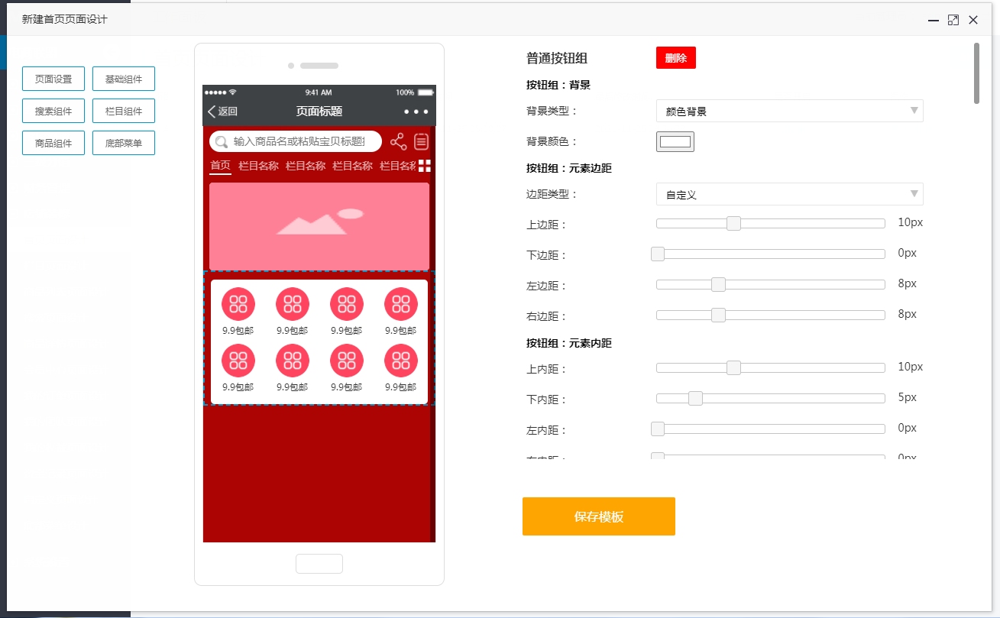  
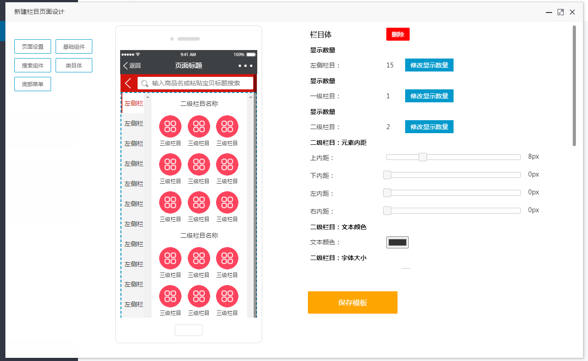  
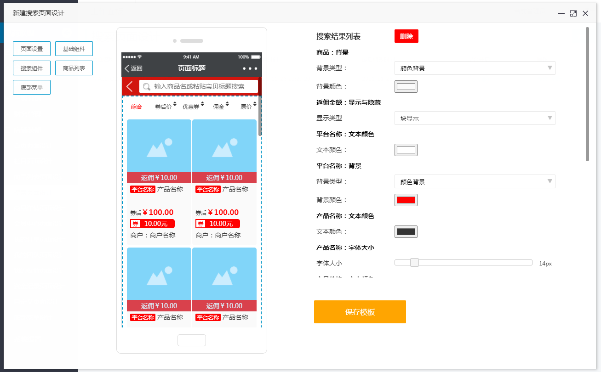  
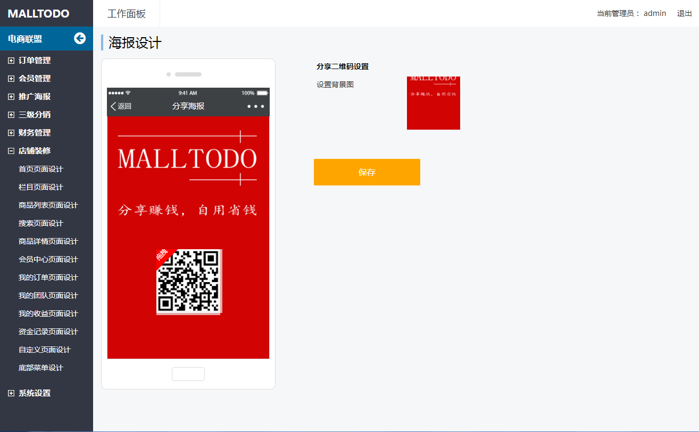  
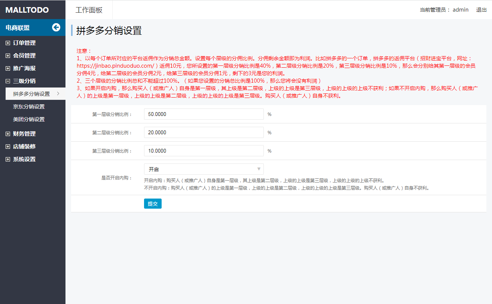  
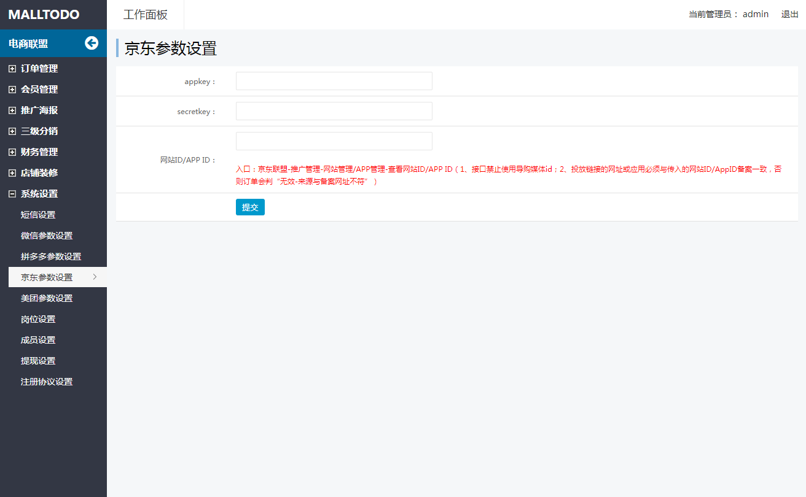  
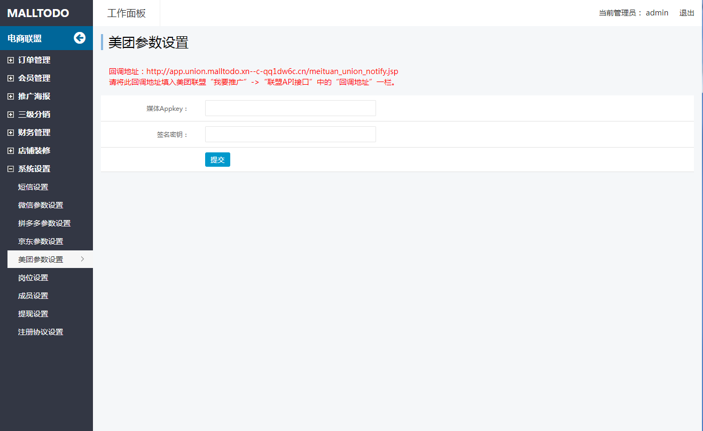  
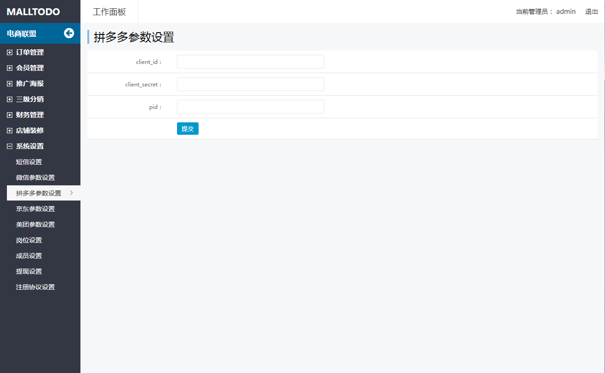  
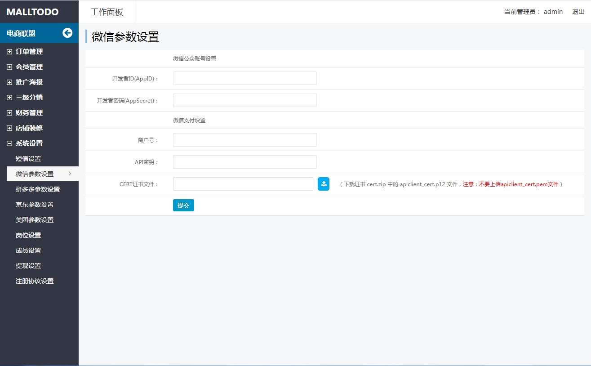  
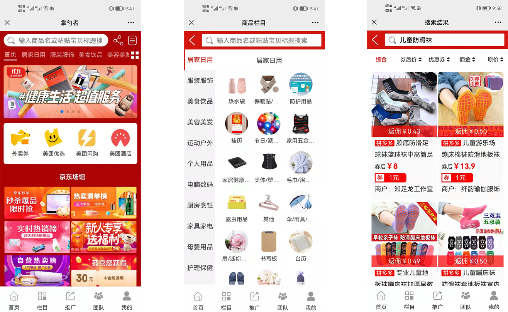  

# MALLTODO零代码企业建站系统
MALLTODO零代码建站系统可以帮助用户快速搭建个性化的企业官网，无需专业的编程知识，提供可视化设计器及管理后台，网站的制作过程就像搭积木一样把需要的组件拖拽过来。真正做到“会打字就能建网站”，且所生成的网站均为响应式，支持电脑端，平板，手机等所有设备，还可以嵌入微信公众号，小程序，抖音，快手等平台。  

# 与其他同类型产品的区别

**MALLTODO零代码建站系统不同于市面上其他类似的系统，其他系统大多是基于vue开发的，做出来的网站百度收录不了，这个系统是我们自己研发的模板引擎，可以生成实实在在的html代码，所以百度可以收录，并且可以做SEO优化。**  
  
MALLTODO 的官方网址是： www.malltodo.com

# 免费版与收费版的区别
免费版的组件较少，收费版的组件更为丰富。  

# MALLTODO软件截图

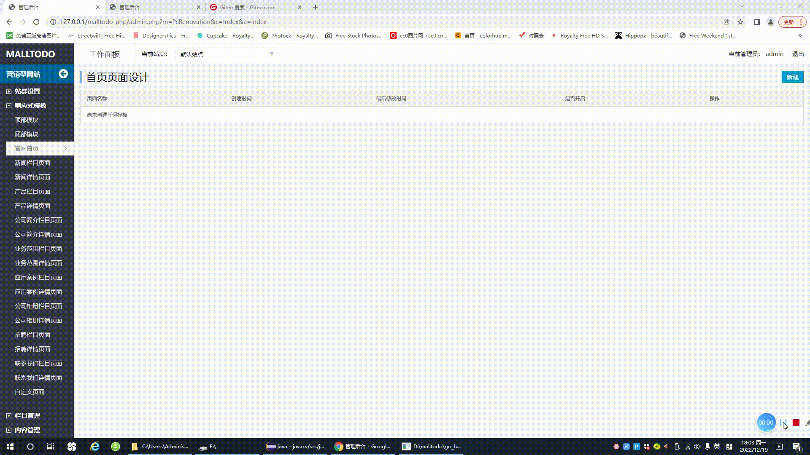  
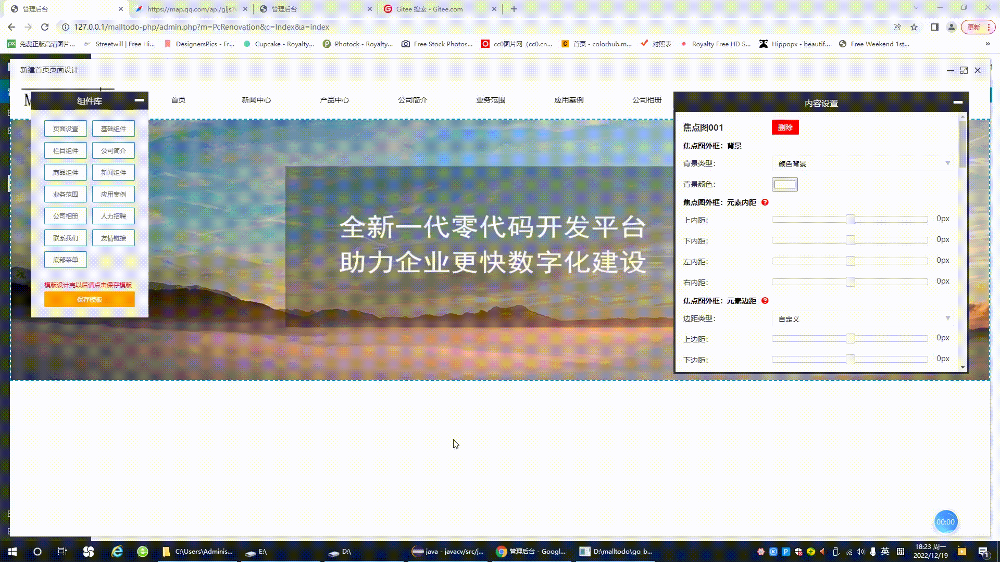  
  
  
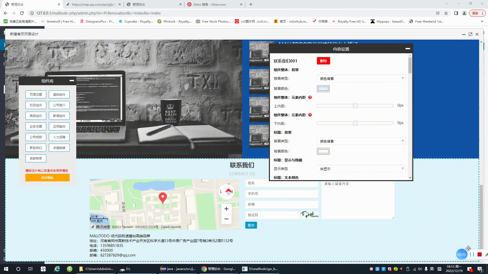  
  
 

# MALLTODO技术交流

  

# MALLTODO安装
1 安装java环境，对于java程序员来讲配置java环境不是什么难事，对于不太熟悉java环境的朋友可以参考下面这个网页，它很详细地介绍了java开发环境的搭建。（MALLTODO推荐使用jdk1.8和tomcat8，其他版本的目前未经过测试）对于找不到java8安装包的朋友可以到360的软件宝库中下载。 
Java 开发环境配置：https://www.runoob.com/java/java-environment-setup.html

2 安装tomcat，参考下面链接。（熟悉的朋友可以直接跳过）
https://www.runoob.com/servlet/servlet-environment-setup.html

3 下载MALLTODO，github或者gitee仓库中的MALLTODO是以源码的形式提供的，但是里面也包含有已经编译过的class文件，可以直接使用，无需再次编译。  
1）下载MALLTODO，然后解压，解压后可以发现里面有一个WebContent文件夹，这个文件夹里面包含有网站的静态文件以及编译好的class文件和其他jar文件，可以直接上传到服务器上使用。  
2）修改tomcat的配置文件，使其指向WebContent文件夹（tomcat的配置文件在：tomcat安装目录/conf/server.xml，打开后找到Host节点，然后在节点内加上\<Context path="/" docBase="WebContent文件夹的路径" debug="0" reloadable="true"/>）  
3）启动tomcat，打开浏览器，输入127.0.0.1:8080按照提示步骤进行安装。

详细的安装视频如下：  
https://v.youku.com/v_show/id_XNTgyNTA2MTQxNg==.html

安装完成以后，官网前台：您的域名/index.jsp；电商联盟系统前台：您的域名/index.union.jsp；网站后台：您的域名/admin.jsp  

# MALLTODO后台操作视频详解
MALLTODO电商联盟系统后台操作视频详解：  
（1）MALLTODO后台操作指南——首页设计，链接地址：https://v.youku.com/v_show/id_XNTgyNDY0MDQ3Mg==.html  
（2）MALLTODO后台操作指南——栏目页设计，链接地址：https://v.youku.com/v_show/id_XNTgyNTAzMTgzNg==.html  
（3）MALLTODO后台操作指南——商品列表页设计，链接地址：https://v.youku.com/v_show/id_XNTgyNTAzNDkxNg==.html  
（4）MALLTODO后台操作指南——商品搜索页设计，链接地址：https://v.youku.com/v_show/id_XNTgyNDY0ODEwNA==.html  
（5）MALLTODO后台操作指南——商品详情页设计，链接地址：https://v.youku.com/v_show/id_XNTgyNDY0ODI0NA==.html  
（6）MALLTODO后台操作指南——会员中心页设计，链接地址：https://v.youku.com/v_show/id_XNTgyNTAzOTYyMA==.html  
（7）MALLTODO后台操作指南——我的订单页设计，链接地址：https://v.youku.com/v_show/id_XNTgyNTAzOTcxNg==.html  
（8）MALLTODO后台操作指南——我的团队页设计，链接地址：https://v.youku.com/v_show/id_XNTgyNDY1MDAwMA==.html  
（9）MALLTODO后台操作指南——我的收益页设计，链接地址：https://v.youku.com/v_show/id_XNTgyNDY0ODY4NA==.html  
（10）MALLTODO后台操作指南——资金记录页设计，链接地址：https://v.youku.com/v_show/id_XNTgyNTA0NDAxMg==.html  
（11）MALLTODO后台操作指南——海报设计，链接地址：https://v.youku.com/v_show/id_XNTgyNTMzMjA2OA==.html  
（12）MALLTODO后台操作指南——三级分销，链接地址：https://v.youku.com/v_show/id_XNTgyNTMzMjI4MA==.html  

# 将MALLTODO导入eclipse中进行二次开发
下载MALLTODO，解压后直接导入eclipse中即可进行二次开发。  
操作视频：https://v.youku.com/v_show/id_XNTgyNTUxMTU5Mg==.html

# MALLTODO协议条款
为了使你正确并合法的使用本软件，请你在使用前务必阅读清楚下面的协议条款：

一、本授权协议适用且仅适用于 MALLTODO V2.x 版本，MALLTODO官方对本授权协议的最终解释权。  
二、协议许可的权利
1、您可以在完全遵守本最终用户授权协议的基础上，将本软件应用于商业用途，而不必支付软件版权授权费用。

2、您可以在协议规定的约束和限制范围内修改 MALLTODO 源代码或界面风格以适应您的网站要求。

3、您拥有使用本软件构建的网站全部内容所有权，并独立承担与这些内容的相关法律义务。

二、协议规定的约束和限制
1、未经官方许可，不得对本软件或与之关联的商业授权进行出租、出售、抵押或发放子许可证。

2、未经官方许可，禁止在 MALLTODO 的整体或任何部分基础上以发展任何派生版本、修改版本或第三方版本用于重新分发。

3、如果您未能遵守本协议的条款，您的授权将被终止，所被许可的权利将被收回，并承担相应法律责任。

三、有限担保和免责声明
1、本软件及所附带的文件是作为不提供任何明确的或隐含的赔偿或担保的形式提供的。

2、用户出于自愿而使用本软件，您必须了解使用本软件的风险，在尚未购买产品技术服务之前，我们不承诺对免费用户提供任何形式的技术支持、使用担保，也不承担任何因使用本软件而产生问题的相关责任。

3、电子文本形式的授权协议如同双方书面签署的协议一样，具有完全的和等同的法律效力。您一旦开始确认本协议并安装 MALLTODO，即被视为完全理解并接受本协议的各项条款，在享有上述条款授予的权力的同时，受到相关的约束和限制。协议许可范围以外的行为，将直接违反本授权协议并构成侵权，我们有权随时终止授权，责令停止损害，并保留追究相关责任的权力。

协议发布时间： 2021年09月01日

版本最新更新： 2021年09月01日 By malltodo.com
